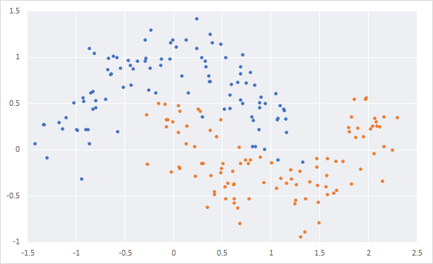

## Objectives
- Learn the basics of progamming with Rust
- Try to use only the basic modules provided with the language
- Address new language concepts one by one
- Implement a basic neural network for classification from scratch, without using any existing code or module.
- Document my learnings (success and failures) in this file, or eventually a blog.


## Project creation
```
> cargo new nn-from-scratch-rs
     Created binary (application) `nn-from-scratch-rs` project

> cd nn-from-scratch-rs

> cargo run   
   Compiling nn-from-scratch-rs v0.1.0 (file:///.../nn-from-scratch-rs)
    Finished dev [unoptimized + debuginfo] target(s) in 8.40s
     Running `target\debug\nn-from-scratch-rs.exe`
Hello, world!
```

## First lines of code
The idea for this project comes from a post by Denny Britz on his blog _"[Implementing a Neural Network from Scratch in Python](http://www.wildml.com/2015/09/implementing-a-neural-network-from-scratch/)"_. Like him, I think that write your own code is an extremely valuable exercise. In my case, there is two goals: learn a new programming language and review mathematical concepts.

I won't make use of any existing machine learning or linear algebra library, so I will have to reimplement all the algorithms I will need.

The first step of any ML project is to have data. We aim to implement a binary classifier. There are a few toy datasets for this kind of problems and we choose to use the "moons dataset". 

We add a function `generate_moons_dataset` that takes in parameters the number of samples `n_samples` and a level of noise to add to the generated data `noise`. It will return a tuple with 2 values: a vector that contains the 2-D coordinates of each samples (usually called `X`) and another vector of the same size of the first one and that contains the labels of each sample (usually called `y`). We will call this function from the main function and we print on the screen the data in CSV format to allow external vizualization.

```rs
fn generate_moons_dataset (n_samples: usize, noise: f64) -> (Vec<(f32,f32)>, Vec<i32>) {
    let X : Vec<(f32,f32)> = Vec::new();
    let y : Vec<i32> = Vec::new();

    (X,y)
}


fn main() {
    // Generating Moons dataset
    let (X,y) = generate_moons_dataset(200, 0.20);

    // Print the data for external visualization
    for (i, coord) in X.iter().enumerate() { 
        println!("{},{},{}", coord.0, coord.1, y[i]);
    }
}
```

There is a lot of things is this code. To summary:
- Functions declaration start with the `fn` keyword.
- The parameters must be declared with a type.
- The type of the return value is specified after the parameters and starts with an arrow `->`.
- The body of the function is a series of statements optionnaly ending with an expression.
- _Statements_ are a suite of instruction that perform some actions and do not return a value. A statement always finishes with a semicolon (`;`).  
  _Expressions_ evaluate to a resulting value. An expression does not include a semicolon at the end.
- To return a value from a function, either use a statement with the `return` keyword, or use an expression that will be automatically considered as the returned value.
- __...__

Executing `cargo run` on this code displays a number of unexpected warnings:
- `unused variable 'n_sample' ['noise']. consider using '_n_sample' ['_noise'] instead.`  
  The 'unused variable' warning was expected, but the way to silent this warning is original: just rename the parameter with a leading underscore.
- `variable 'X' should have a snake case name such as 'x'`  
  This one is less funny. Having the coding style enforced by the compiler is probably a good idea, but this can be sometimes constraining. In this particular case, the uppercase X notation is the standard in the ML community to name the sample vector. Changing this convention may make the code less legible. i will rename these variables as `samples` and `labels`.

The "Moons Dataset" consists in 2 balanced interleaved clusters:



To generate it, we will draw samples from 2 half-circles. We will start from evenly spaced points on this 2 half-circles. We will first implement a function that returns a vector of evenly spaced values over an interval. This function is usually called `linspace`.


```rs
fn linspace(x1:f32, x2:f32, n:usize) -> Vec<f32> {

    let mut y : Vec<f32> = Vec::with_capacity(n);
    
    let step = (x2 - x1) / (n - 1) as f32;

    for i in 0..n {
        y.push(x1 + step * i as f32);
    }

    y
}
```

We first allocate a vector with the requested number of points with the method `Vec::with_capacity(usize)`. This allows to allocate the memory that will be needed to store each value in the vector. This is good practice when you know the size of a vector, because it avoids multiple alloc/free when we push data in the vector.

Also note that we've added the `mut` keyword in this declarations. By default, all variables are immutable, which means that once they are initialized, their value cannot change. In this case, we want to fill the vector with custom values, so we need to tell the compiler that we want to mutate it. We do this with the help of the keyword `mut` in the declaration. If we forgot to put this keyword, we would have the following error by the compiler: `cannot borrow immutable local variable 'y' as mutable`.

We want $n$ points evely spaced on the closed interval $[x_1,x_2]$. So the step is $(x_2-x_1)/(n-1)$. If we wanted to sample the open interval $[x_1,x_2[$, it would have been $(x_2-x_1)/n$.

Rust is very strict on types and it will never automatically cast a type into another one and the compilation will fail. This is shown twice in this code:
- `cannot divide 'f32' by 'usize'`: `x1` and `x2` are floats, and `n` is an integer
- `cannot multiply 'usize' to 'f32'`: `step` is a float and `i` is an integer

So, we must cast each value everytime. The easiest and most legible way I found so far to solve this is the `as` keyword. I'm not sure this is the best one.

To make sure our method works as intended, we can write a test function. Rust allows to write tests inside your program and to execute them as part of the build process. This is enabled by an annotation before the test function that indicates this is a test function.

```rs
#[test]
fn linspace_test() {
    assert_eq!(linspace(0.0, 1.0, 5), vec![0.0, 0.25, 0.5, 0.75, 1.0])
}
```

We can execute the tests with the command `cargo test`:
```
> cargo test
    Finished dev [unoptimized + debuginfo] target(s) in 0.03s
     Running target\debug\deps\nn_from_scratch_rs-53c8ce43a51889fe.exe

running 1 test
test linspace_test ... ok

test result: ok. 1 passed; 0 failed; 0 ignored; 0 measured; 0 filtered out
```

Now that we have `linspace`, we can sample evenly an half-circle. We change the `generate_moons_dataset` function to add the code to generate an half-circle.

```rs
fn generate_moons_dataset (n_samples: usize, _noise: f64) -> (Vec<(f32,f32)>, Vec<i32>) {
    let mut samples : Vec<(f32,f32)> = Vec::with_capacity(n_samples);
    let mut labels : Vec<i32> = Vec::with_capacity(n_samples);

    let n_0 = n_samples / 2;
    let angles_0 = linspace(0.0, f32::consts::PI, n_0);
    for angle in angles_0.iter() {
        let (sin,cos) = angle.sin_cos();
        samples.push((cos, sin));

        labels.push(0);
    }

    (samples, labels)
}
```

At first, we initialize the output vectors at the right capacity to avoid memory reallocation. Here again, note that we used the `mut` keyword because we want to fill the vectors with our computed values.

We only use half the samples for this first cluster, and we identify them with the label '0'. For each angle in the vector returned by `linspace`, we compute the $sin$ and the $cos$ values that we use as the x and y coordinates for this sample.
We cannot iterate directly the vector and we need to create an iterator from it with the method `iter()`.

Running the application as-is gives us the following data set:


Pretty good! Now, we want to add sopme noise to the position of the sample, to create a more realistic cluster. To to this, we draw random values from the normal distribution $\mathcal{N}(0,\sigma^2)$, where $\sigma$ has the value of the `noise` parameter.

The Rust language comes with a few preincluded packages (or _library crates_ in the Rust vocabulary) in what they call the _standard prelude_. these packages import the most common features of the language in your application. Random number generation is not in this prelude and we need to import an external crate. To do this, we add in the `cargo.toml` file the line `rand="0.5"` in the dependencies section. `rand` is the name of the crate we want to import from the `crates.io` repository, and `"0.5"` is the version. Cargo will handle the download and the installation of all the package for us at the next build.

To use the crate in our code, we need to add the following lines at the beginning:
```rs
extern crate rand;
use rand::thread_rng;
use rand::distributions::Normal;
```

The first line is used to let Rust know that we use the `rand` crate as an external dependency. This allows to call anything in the package by placing `rand::` before the name.  
The following `use` statements import some common names in our namespace, so we don't have to use their full name with namespace.

The library provides us with a thread-local RNG (`rand::thread_rng()`), and a Normal distribution object (`rand::distributions::Normal(mean, stdev)`). We use them together to draw random number `normal.sample(&mut rng)`.

The new function is:
```rs
fn generate_moons_dataset (n_samples: usize, noise: f64) -> (Vec<(f32,f32)>, Vec<i32>) {
    let mut samples : Vec<(f32,f32)> = Vec::with_capacity(n_samples);
    let mut labels : Vec<i32> = Vec::with_capacity(n_samples);

    let mut rng = thread_rng();
    let normal = Normal::new(0., noise);

    let n_0 = n_samples / 2;
    let angles_0 = linspace(0.0, f32::consts::PI, n_0);
    for angle in angles_0.iter() {
        let (sin,cos) = angle.sin_cos();
        samples.push((cos + normal.sample(&mut rng) as f32, sin + normal.sample(&mut rng) as f32));

        labels.push(0);
    }

    (samples, labels)
}
```

But when we compile this code, it fails with the error:  
`no method named 'sample' found for type 'rand::distributions::Normal' in the current scope. Help: items from traits can only be used if the trait is in scope`.

`Normal` is a simple struct defined as:
```rs
pub struct Normal {
    mean: f64,
    std_dev: f64,
}

impl Normal {
    pub fn new(mean: f64, std_dev: f64) -> Normal {
        assert!(std_dev >= 0.0, "Normal::new called with `std_dev` < 0");
        Normal {
            mean,
            std_dev
        }
    }
}
```

There is indeed no reference to a `sample` method. This method is defined in a Trait that the `Normal` struct implements. A _Trait_ specify the functionnality a particular type has and can share with other types. This is equivalent of interfaces in other languages. A trait defines the functions that must be implemented by a type. In our case, the trait is `Distribution` and several structs implement it in the crate, for example `Normal`, `Uniform` or `Beta`. The `sample` method is declared in the `Distribution` trait and is implemented for the struct `Normal` as:

```rs
impl Distribution<f64> for Normal {
    fn sample<R: Rng + ?Sized>(&self, rng: &mut R) -> f64 {
        let n = rng.sample(StandardNormal);
        self.mean + self.std_dev * n
    }
}
```

This has 2 consequences:
- We must import the trait `Distribution` in our scope in order to use its methods.
- The method returns a value of type `f64` that should be down-casted into `f32` to allow the addition.


If we now run the application, it outputs a dataset like this one:


Now, we just have to create a similar cluster with the label '1'. We create another noisy half-circle, inverted wrt the y-axis and translated on both axis to interleave the clusters.

```rs
fn generate_moons_dataset (n_samples: usize, noise: f64) -> (Vec<(f32,f32)>, Vec<i32>) {
    let mut samples : Vec<(f32,f32)> = Vec::with_capacity(n_samples);
    let mut labels : Vec<i32> = Vec::with_capacity(n_samples);

    let mut rng = thread_rng();
    let normal = Normal::new(0., noise);

    let n_samples_out = n_samples / 2;
    let rad_out = linspace(0.0, f32::consts::PI, n_samples_out);
    for i in 0..n_samples_out {
        let (sin,cos) = rad_out[i].sin_cos();
        samples.push((cos + normal.sample(&mut rng) as f32, sin + normal.sample(&mut rng) as f32));
        labels.push(0);
    }

    let n_samples_in = n_samples - n_samples_out;
    let rad_in = linspace(0.0, f32::consts::PI, n_samples_in);
    for i in 0..n_samples_out {
        let (sin,cos) = rad_in[i].sin_cos();
        samples.push((1. - cos + normal.sample(&mut rng) as f32, 1. - sin - 0.5 + normal.sample(&mut rng) as f32));
        labels.push(1);
    }

    (samples, labels)
}
```


We can try to simplify this code.  
First, we can sample the full circle, and then use 2 for loops for each cluster:
```rs
    let angles = linspace(0.0, 2.0 * f32::consts::PI, n_samples);

    for i in 0 .. n_samples/2 {
        let (sin,cos) = angles[i].sin_cos();
        [...]
    }
    for i in n_samples/2 .. n_samples {
        let (sin,cos) = angles[i].sin_cos();
        [...]
    }
```

We can also directly create a vector with the sin/cos pair:
```rs
let sc : Vec<_> = linspace(0.0, 2.0 * f32::consts::PI, n_samples).iter()
                    .map(|&x| x.sin_cos())
                    .collect();
```

We would also get further in the functional style, and create directly the output vector with combinations of `map`, `zip` and `collect`, but I won't do that right now.

To finalize this part, we add some sanitary checks in the methods that will panic if the provided parameters are out-of-bounds.
In `linspace`, we check that $x_1 < x_2$ and that $n >= 2$:
```rs
assert!(x1 < x2, "linspace called with x1 >= x2");
assert!(n >= 2,  "linspace called with n < 2");
```

In `generate_moons_dataset`, we should have $\operatorname{n_{samples}} >= 2$ and $\operatorname{noise}>=0$:
```rs
assert!(n_samples >= 2, "generate_moons_dataset called with n_samples < 2");
assert!(noise >= 0.0, "generate_moons_dataset called with noise < 0");
```

---
## _Backup_

        assert!(std_dev >= 0.0, "Normal::new called with `std_dev` < 0");
